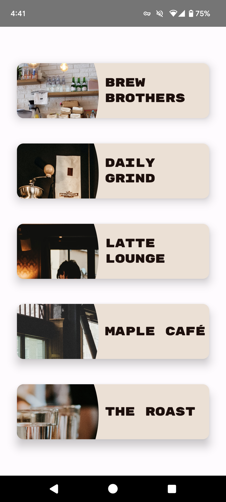
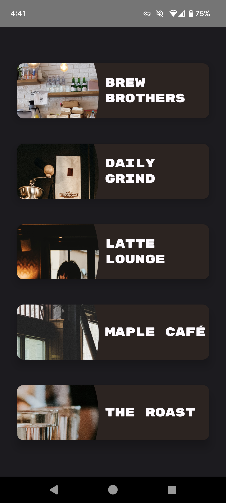
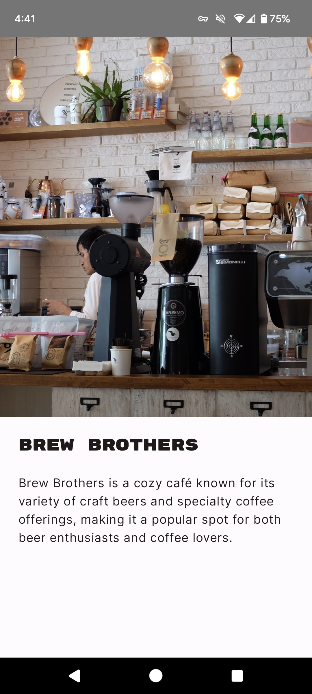
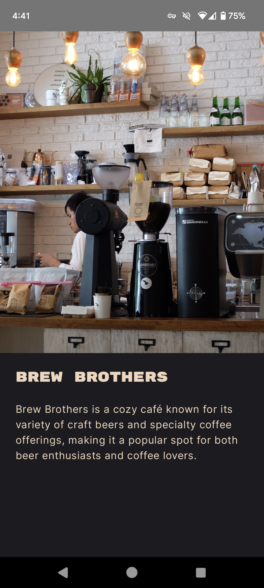

# NY-Eats

Disclaimer: This app was creating for learning purposes and all locations and descriptions are fictitious.

### Description
NY Eats is an informational app that lists places to eat in New York City! First, choose from three categories: Coffee Shops, Fast Food, or Restaurants. Next, pick a location to see its image and a short description. That's all there is to it! 
NY Eats was creating with accessibility in mind and with a focus on responsive design.

### Showcase

#### Sample Use

#### Categories

&nbsp; &nbsp; &nbsp; &nbsp;

#### Locations

&nbsp; &nbsp; &nbsp; &nbsp;

#### Details

&nbsp; &nbsp; &nbsp; &nbsp;

