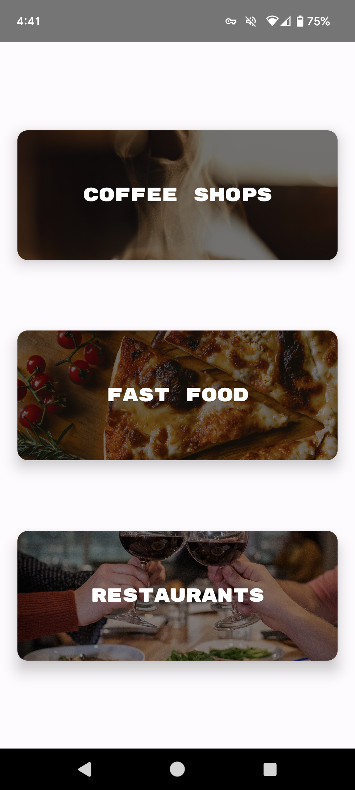
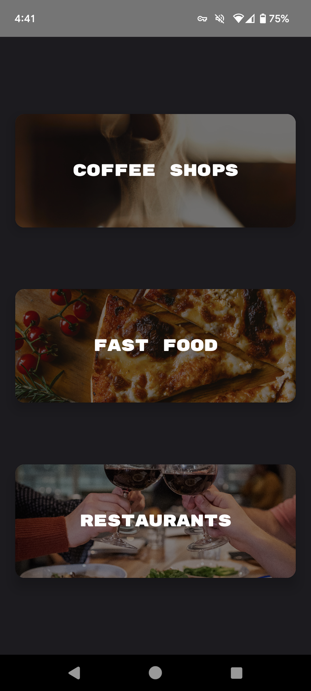

# NY Eats

Disclaimer: This app was creating for learning purposes and all locations and descriptions are fictitious.

### Description
NY Eats is an informational app that lists places to eat in New York City! First, choose from three categories: Coffee Shops, Fast Food, or Restaurants. Next, pick a location to see its image and a short description. That's all there is to it! 
NY Eats was creating with accessibility in mind and with a focus on responsive design.

### Showcase

#### Sample Use

 &nbsp; &nbsp; &nbsp; &nbsp; 

#### Categories (Compact)

 &nbsp; &nbsp; &nbsp; &nbsp; 

#### Locations (Compact)

 &nbsp; &nbsp; &nbsp; &nbsp; 

#### Details (Compact)

 &nbsp; &nbsp; &nbsp; &nbsp; 

#### Categories (Expanded)

 &nbsp; &nbsp; &nbsp; &nbsp; 

#### Categories with Locations (Expanded)

 &nbsp; &nbsp; &nbsp; &nbsp; 
 &nbsp; &nbsp; &nbsp; &nbsp; 

#### Details (Expanded)

 &nbsp; &nbsp; &nbsp; &nbsp; 
 &nbsp; &nbsp; &nbsp; &nbsp; 
